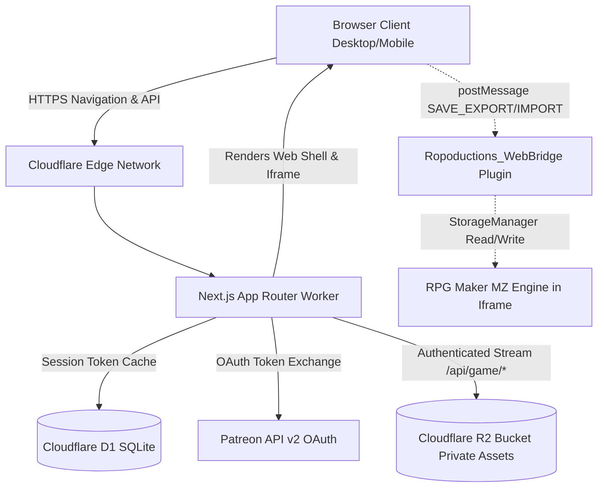
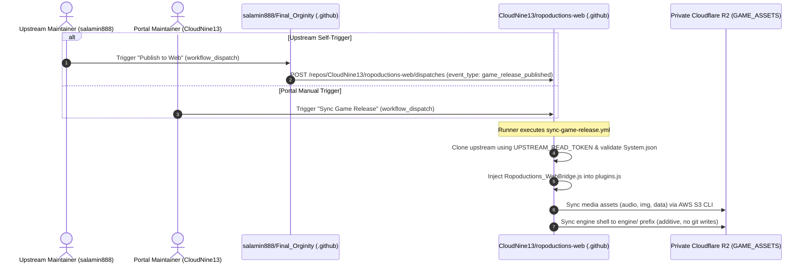

# Architecture Spine — Ropoductions Web Portal

## Design Paradigm

The system follows an **Edge-BFF (Backend-For-Frontend) with Sandboxed Engine Shell** architecture. 

* **Outer Web Shell (Next.js App Router on Cloudflare Workers):** Owns marketing presentation, 21+ age verification, Patreon OAuth 2.0 authentication, session persistence, and the floating Save HUD dock.
* **Inner Engine Shell (Sandboxed Same-Origin Iframe):** Owns execution of the compiled RPG Maker MZ HTML5/WebGL runtime, audio playback, and local `rmmz_save` storage.
* **Edge Proxy Layer (Cloudflare Worker & R2):** Owns authenticated streaming of encrypted static game assets from private object storage, verifying patron sessions at the network edge before releasing bytes.
* **Bridge Communication:** Decoupled bidirectional postMessage bus connecting the outer Web Shell to the inner game engine for save serialization and injection.



---

## Invariants & Rules

### AD-1 — Target Framework and Runtime Binding [ADOPTED]

- **Binds:** CAP-1, CAP-2, CAP-3, CAP-4, CAP-5, CAP-6, CAP-7, CAP-8
- **Prevents:** Node.js native dependency drift, vendor lock-in incompatibilities, and broken edge runtime compilations.
- **Rule:** The entire web application must be built using Next.js 15+ (App Router) compiled with `@opennextjs/cloudflare` targeting the Cloudflare Workers serverless runtime. All server route handlers must strictly use standard Web Fetch API `Request` and `Response` objects without referencing unsupported Node.js native modules (`fs`, `net`, `child_process`).

### AD-2 — Same-Origin Iframe Sandboxing for Engine Runtime [ADOPTED]

- **Binds:** CAP-5, CAP-6, FR-10, FR-13
- **Prevents:** Global `window` pollution between RPG Maker MZ engine variables (`$dataActors`, `$gamePlayer`, PixiJS) and React DOM lifecycle; prevents browser storage namespace partitioning.
- **Rule:** The RPG Maker MZ game must be hosted within a same-origin `<iframe>` element on the `/play` route. The iframe's `src` must point to `/engine/index.html` under the identical web origin (`protocol://domain:port`). Dedicated subdomains or external hosting domains are strictly prohibited to ensure uninterrupted access to the shared `IndexedDB` (`rmmz_save`) namespace across deployments.

### AD-3 — Cryptographic Session Cookie and D1 Token Isolation [ADOPTED]

- **Binds:** CAP-3, CAP-4, FR-6, FR-7, NFR-2
- **Prevents:** Exposure of Patreon OAuth access/refresh tokens to client-side JavaScript, token theft via XSS, and cookie tampering.
- **Rule:** Client browsers must only receive an opaque, signed, HTTP-only, `SameSite=Lax`, `Secure` session cookie holding a random UUIDv4 `session_id`. Patreon access tokens, refresh tokens, active tier IDs, and token expiration timestamps must be stored strictly server-side in Cloudflare D1. Route handlers and middleware must validate the session cookie against D1 before granting access to `/play` or `/api/game/*`.
### AD-4 — Origin-Locked PostMessage Save Bridge [ADOPTED]

- **Binds:** CAP-7, FR-14, FR-15
- **Prevents:** Cross-origin script injection, unauthorized save data tampering, and malicious prototype pollution crashes.
- **Rule:** Communication between the Next.js Web Shell and the in-game `Ropoductions_WebBridge.js` plugin must strictly specify and validate `event.origin === window.location.origin`. Inbound save payloads received by the bridge must validate schema structure before invoking `StorageManager.saveObject()`.

### AD-5 — Private R2 Asset Streaming with Edge Session Authentication [ADOPTED]

- **Binds:** CAP-8, FR-17, FR-18, NFR-1
- **Prevents:** Direct hotlinking, unauthorized asset ripping, and unauthenticated public scraping of static game files.
- **Rule:** The Cloudflare R2 bucket (`GAME_ASSETS`, pre-created in Cloudflare dashboard and bound in `wrangler.toml`) must remain completely private with zero public HTTP access. All asset requests must route through `/api/game/[...path]`, and the engine shell through `/engine/[...path]`. Both route handlers must verify the presence of an active patron session in D1 before streaming the file from R2. Media responses include `Cache-Control: private, max-age=86400` so legitimate clients cache assets locally while blocking public CDN distribution. Release-addressed shell responses (`?v=<releaseId>`), produced by the ingestion pipeline under AD-9, are cached `private, immutable, max-age=31536000`; the shell document itself revalidates (`private, no-cache`) because it is how a client discovers the published shell. The runtime holds no release state: it applies that policy from the URL shape and never resolves, compares or remembers a release.

### AD-6 — Client-Side .zip Save Packaging and Engine Schema Invariance [ADOPTED]

- **Binds:** CAP-6, CAP-7, FR-14, FR-15
- **Prevents:** Save slot fragmentation, manual multi-file extraction friction, and patch deployment save loss.
- **Rule:** The Save HUD export action must package all populated save slots (slots 1 through 20, `global.rpgsave`, and `config.rpgsave`) into a single `.zip` archive using `jszip` client-side. The import action must accept both `.zip` archives and single `.rpgsave` files. Game developers must ensure RPG Maker MZ plugins provide fallback initialization for unpopulated variables when loading older save files into newer patch builds.

### AD-7 — Navigation-Based Subscription Verification [ADOPTED]

- **Binds:** CAP-4, FR-9, SM-C1
- **Prevents:** Abrupt mid-gameplay disconnections during active boss fights or dungeon exploration due to background token expiration.
- **Rule:** Patron subscription status verification must occur exclusively upon page navigation, entry to the `/play` route, and initial game asset requests. Periodic background polling that terminates active gameplay sessions is strictly prohibited.

### AD-8 — Parameterized D1 Database Access and Versioned Migrations [ADOPTED]

- **Binds:** CAP-3, FR-7, Architecture Evolution (v2)
- **Prevents:** SQL injection vulnerabilities and uncoordinated database schema drift.
- **Rule:** All database interactions with Cloudflare D1 must execute parameterized prepared statements (`db.prepare().bind()`). Direct string concatenation into SQL statements is prohibited. Database schema changes must be versioned as sequential SQL files under `migrations/` and deployed via Wrangler.
- **Addendum (2026-09-19, epic-5 retrospective):** Privilege-invariant integrity convention — every write that can change an actor's effective role (`patron_overrides` upsert, update, delete) must (1) re-verify the calling actor's authority at mutation time against freshly-read state, not a request-cached session alone; (2) carry its own atomic guard in the statement at the row-write boundary when an invariant must hold (the `deletePatronOverrideGuarded` single-statement pattern is the reference shape), never in a separate read-then-write step; and (3) leave attribution intact (mutation fields like `granted_by` are set on INSERT, never rewritten on UPDATE). Admin-role determination has exactly one source of truth: the stored sealed/override state materialized at bootstrap time — environment configuration seeds and seals rows at write time; it must not participate in read-time authorization branching. Evidence: findings F3/F4/F6/F7, Amendment A-2026-09-19-01 in `epics.md`.
### AD-9 — Upstream Game Ingestion & R2 Asset Synchronization Pipeline [ADOPTED]

- **Binds:** CAP-5, CAP-8, CAP-11, FR-17, FR-18
- **Prevents:** Cloudflare Edge worker memory exhaustion from Git operations, accidental auto-deployments of broken development assets, and game engine JSON database corruption.
- **Rule:** Cloudflare Edge Workers and Pages functions MUST NEVER interact with Git repositories or execute asset ingestion at runtime. Upstream game assets from `salamin888/Final_Orginity` are ingested via a dedicated GitHub Action in `ropoductions-web` (`.github/workflows/sync-game-release.yml`).
  - **Trigger Modes (Dual Trigger):**
    1. **Portal Maintainer Manual Trigger:** `workflow_dispatch` within `CloudNine13/ropoductions-web` with input `branch` (defaulting to `auto`).
    2. **Upstream Remote Trigger:** `repository_dispatch` with event type `game_release_published`, enabling upstream game maintainers (`salamin888`) to trigger web publication directly from their repository upon publishing a release.
  - **Security Boundary & Secret Isolation:** Upstream maintainers are NEVER given Cloudflare API tokens, R2 S3 access keys, or repository write access to `ropoductions-web`. Upstream triggers the pipeline using a fine-grained GitHub Personal Access Token (PAT) with `Actions: Read and write` scoped exclusively to dispatching workflows on `CloudNine13/ropoductions-web`. All Cloudflare R2 secrets (`R2_ACCESS_KEY_ID`, `R2_SECRET_ACCESS_KEY`, `CLOUDFLARE_ACCOUNT_ID`) and upstream clone credentials (`UPSTREAM_READ_TOKEN`) reside strictly within `ropoductions-web` GitHub Secrets.
  - **Execution Protocol:** The runner resolves target branch (`client_payload.branch` if present, else manual input, falling back to `tools/release.json` `base` version if `auto`), shallow-clones the release branch using `UPSTREAM_READ_TOKEN`, validates the file structure (`Final Orginity/data/System.json`, `package.json`, `index.html`), injects `Ropoductions_WebBridge.js` into `js/plugins/` and registers it in `js/plugins.js`, then performs purely additive AWS CLI S3 syncs (`--endpoint-url`, never `--delete`) to private R2 (`GAME_ASSETS`): media assets (`audio/`, `img/`, `effects/`, `movies/`, `data/`) to their top-level keys, and the lightweight HTML5 shell (`index.html`, `js/`, `css/`, `fonts/`, `icon/`, `package.json`; the release-addressed form is produced by the 2026-09-22 addendum below, and `build-metadata.json` is deliberately excluded from the upload) to the `engine/` prefix. The runner runs with `permissions: contents: read` and NEVER writes to any branch — the shell is served to patrons at runtime by the `/engine/[...path]` route (AD-1/AD-5), which streams the `engine/` prefix from R2, gated like `/api/game`, and falls back to the website-owned mock harness while no shell is published.
  - **Decoupled Runtime Testing Invariant:** Development and testing of the web client iframe container (Story 3.1) and Save HUD postMessage bridge (Epic 4) are completely decoupled from upstream release availability. The web player container can be verified locally and in CI using a lightweight mock canvas harness (`src/engine-plugins/mock-shell.html`, embedded into the worker bundle via `scripts/generate-engine-mock.ts` → `src/lib/engine-mock.generated.ts`) served by the `/engine/[...path]` route at `/engine/index.html` while R2 holds no published shell, adhering to the identical origin and postMessage protocol. Anonymous requests receive only this harmless placeholder (no R2 or D1 access), so release state is never disclosed before authorization.
  - **Addendum (2026-09-22, Story 7.2, owner directive OD-2b — release addressing):** Game version identity is owned entirely by this pipeline and never by the runtime. Before the shell is synced, the ingestion engine computes the release identifier as sha256 over the sorted staged-shell manifest plus `ADDRESSING_REVISION`, bakes `?v=<releaseId>` into every shell subresource reference it can reach (document `src`/`href` attributes, the `main.js` boot-script loop, the Effekseer wasm URL, `PluginManager.makeUrl`, `FontManager.makeUrl`), and fails the run — publishing nothing — when a URL-builder expression is not the one the rules were written for. `build-metadata.json` records `releaseId`/`addressingRevision` for humans in the runner log and is **excluded from the R2 sync**: no release metadata object is readable by the runtime, and no pointer object, versioned prefix or release registry is introduced. The sync stays purely additive into the release-agnostic `engine/` prefix, so publishing a release replaces the previously published shell. The runtime half of the contract lives in AD-5.



### AD-10 — Two-Tier Admin Architecture: Immutable Creator Admins & Panel-Assigned Overrides [ADOPTED]

- **Binds:** CAP-3, CAP-10, FR-6, FR-20, FR-21
- **Prevents:** Studio founder lockout, unrecorded administrative privilege escalation, accidental or malicious founder deletion via internal admin tools, and brittle manual production database seeding.
- **Rule:** The portal strictly enforces a Two-Tier Administrative Access Model:
  1. **Creator Admins (Permanently Sealed & Immutable):**
     - A designated set of founding creator Patreon IDs (initially 1, scaling to 2-3) configured via `CREATOR_ADMIN_PATREON_IDS` (or `INITIAL_ADMIN_PATREON_IDS`).
     - Stored with `granted_by = 'creator_bootstrap'` and badged as "Creator Admin (Sealed)".
     - **Immutability Invariant:** NOBODY can delete, modify, or downgrade a Creator Admin ID. The admin panel omits all delete/edit actions for these records, and database/Server Action mutation endpoints strictly reject modification attempts with HTTP 403 Forbidden.
  2. **Panel-Assigned Admins (Mutable & Managed):**
     - Additional team members or playtesters granted elevated roles (`admin` or `comp`) by active administrators through the `/admin/overrides` interface.
     - Stored with `granted_by = session.patron_id`.
     - Can be updated or revoked by other authorized administrators, protected by sole-admin lockout prevention (at least one active administrator must remain at all times).
  - **Local Development Seeding:** The CLI command `npm run db:seed:admins` reads `CREATOR_ADMIN_PATREON_IDS` (or `INITIAL_ADMIN_PATREON_IDS`) from `.dev.vars`, `.env.local`, `process.env`, or CLI arguments and ensures all creator admin passes are seeded into local D1 SQLite.
- **Addendum (2026-09-21, Epic 6 — admin entry point):** The CAP-11 / FR-22 admin-only entry controls (the `/play` header and the portal header) resolve administrator identity server-side from this AD's own override sources — `patron_overrides` rows and the `CREATOR_ADMIN_PATREON_IDS` creator bootstrap — never from the session `role` column: the authorized-pledge path returns the raw patron session before the override table is consulted, so an admin holding an active pledge keeps role `patron` and would be invisible to role-based gating. A shared resolver returning `"admin" | "comp" | null` renders the entry only for `"admin"`. Redirect-based admin walls were considered and rejected by owner decision (Q9): `/admin` continues to return 404 for every non-admin request, the authentication flow is unchanged, and the sealing and two-tier immutability rules above are untouched by this addendum. The edge proxy route matcher (`src/proxy.ts`) must never gain an `/admin` entry — a middleware redirect on `/admin` would itself disclose the route's existence.

### AD-11 — Single-Tree Viewport and Engine-Frame Lifecycle Invariant [ADOPTED]

- **Binds:** CAP-5, CAP-12, FR-10, FR-12, FR-14, FR-23
- **Prevents:** Engine iframe remount and reload on fullscreen toggle (RPG Maker MZ returning to the title screen and losing in-memory progress), dock-chrome recreation resetting idle-dim timers and in-flight export state, and save-and-reload fallbacks that mask a remount defect instead of removing it.
- **Rule:** The `/play` game viewport must render exactly one invariant DOM tree in both windowed and fullscreen presentation. A fullscreen toggle may change only class names on that tree. The engine `<iframe>` element must never be unmounted, recreated, relocated in the DOM, or subjected to a remount-inducing key change. Conditional JSX branches that return structurally different trees for windowed versus fullscreen state are prohibited. There is no save-and-reload fallback: state continuity is achieved solely by never disturbing the frame.
- **Testable properties (added 2026-09-21, Epic 6):** The engine boot count — the number of `load` events observed on the engine iframe — must remain exactly 1 across any sequence of fullscreen enter→exit transitions, and the iframe DOM node identity must be preserved across each toggle (zero mutations on the iframe node). The pre-fix two-branch implementation measured `load` events 1→2→3 per enter→exit with two DOM moves per toggle; a control experiment confirmed that promoting an ancestor into the browser top layer does not reload a child iframe, so the invariant is host-side and enforceable by end-to-end assertion.
---

## Consistency Conventions

| Concern | Convention |
|---|---|
| File naming | `kebab-case` for components, routes, and utility modules (`age-gate-dialog.tsx`, `save-hud.tsx`). |
| API Route naming | RESTful lowercase plural paths (`/api/auth/patreon`, `/api/auth/callback`, `/api/game/[...asset]`). |
| D1 Table naming | `snake_case` plural names (`sessions`, `patrons`, `merchandise_items`). |
| D1 Column naming | `snake_case` with explicit unit suffixes (`pledge_cents`, `created_at_sec`, `expires_at_sec`). |
| PostMessage contracts | Typed actions with prefix `ROPODUCTIONS_` (`ROPODUCTIONS_EXPORT_SAVE`, `ROPODUCTIONS_IMPORT_SAVE`). |
| Error response format | JSON envelope `{ error: { code: string, message: string } }` with standard HTTP status codes. |
| Configuration | Environment variables in `.env` and `wrangler.toml` in `UPPER_SNAKE_CASE` (`PATREON_CLIENT_ID`). |
| Localization | Lightweight dictionary JSON files under `src/locales/[locale].json` with automatic fallback to `en`. |

---

## Stack

| Name | Version | Note |
|---|---|---|
| Node.js | >=20.18.0 / 24.x | Supported edge build runtime |
| Next.js | 16.3.5 | App Router + Turbopack |
| React | 19.2.8 | React 19 production build |
| @opennextjs/cloudflare | 1.20.6 | Cloudflare Workers adapter |
| Wrangler | 4.131.2 | Cloudflare Workers CLI |
| Tailwind CSS | 4.0.0 | PostCSS integration with @theme tokens |
| @radix-ui/react-dialog | 1.1.23 | Age gate & modal primitives |
| Lucide React | 1.46.0 | System icons |
| JSZip | 3.10.1 | Save .zip bundle compression |
| TypeScript | 5.8.0 | Strict mode compilation |
| next-intl | 4.14.5 | Edge localization |
---

## Design System & Theme Foundations

The portal theme standardizes on:
- **Surfaces:** `#090A0F` (Cosmic Black base), `#121522` (deep obsidian card surface), `#1A1D2B` (muted surface).
- **Accents:** `#22C55E` (Studio Emerald primary glow), `#E11D48` (crimson alert/destructive accent), `#FBBF24` (Patron Gold tier badges).
- **Typography:** Display headlines use `Chakra Petch` (Google Fonts; exported with a `cinzel` backward-compatibility alias in `src/lib/fonts.ts`), paired with `Geist Sans` for body copy and `Geist Mono` for system metadata and timestamps.

## Structural Seed

```text
ropoductions-web/
  .open-next/                         # OpenNext compilation cache
  migrations/
    0001_initial_sessions.sql         # D1 initial schema for sessions and token storage
    0002_patron_overrides.sql         # D1 schema for admin and comp role overrides
  public/
    engine/                           # Compiled RPG Maker MZ web export
      index.html                      # Engine bootstrap (sandboxed iframe entrypoint)
      js/
        plugins/
          Ropoductions_WebBridge.js   # postMessage bridge plugin for save I/O
      img/                            # Encrypted placeholder sprites
      audio/                          # Encrypted placeholder audio
      data/                           # Encrypted game JSON data
    favicon.ico
  src/
    app/
      (portal)/                       # Public studio showcase group
        layout.tsx                    # Studio layout with age gate provider
        page.tsx                      # Atmospheric landing page
      (game)/                         # Secured game player group
        play/
          layout.tsx                  # Fullscreen locked layout
          page.tsx                    # Web Player container + Save HUD dock
      (admin)/                        # Isolated studio administration group
        admin/
          overrides/
            page.tsx                  # Override directory and pass creation form
        layout.tsx                    # Minimal admin shell with anti-enumeration 404 guard
      api/
        auth/
          patreon/
            route.ts                  # OAuth 2.0 PKCE initiator
          callback/
            route.ts                  # Patreon OAuth callback and D1 session issuer
          logout/
            route.ts                  # Clears session cookie and purges D1 record
        game/
          [...asset]/
            route.ts                  # Authenticated R2 streaming proxy
    components/
      age-gate-dialog.tsx             # 21+ blocking confirmation modal
      save-hud-dock.tsx               # Floating frosted-glass save control dock
      save-import-dialog.tsx          # .zip / .rpgsave file picker and validator
      patreon-paywall-card.tsx        # Supporter tier breakdown and login trigger
    lib/
      cloudflare.ts                   # D1 and R2 binding helpers
      crypto.ts                       # Token encryption and hashing utils
      patreon.ts                      # Patreon API v2 client
      save-manager.ts                 # Client-side JSZip serialization logic
  wrangler.toml                       # Cloudflare Worker, D1, and R2 resource bindings
  package.json
  tsconfig.json
```

### Initial D1 Database Schema (`migrations/0001_initial_sessions.sql`)

```sql
CREATE TABLE IF NOT EXISTS sessions (
  id TEXT PRIMARY KEY,
  patron_id TEXT NOT NULL,
  email TEXT,
  role TEXT DEFAULT 'patron' NOT NULL CHECK(role IN ('admin', 'comp', 'patron')),
  tier_id TEXT NOT NULL,
  tier_name TEXT NOT NULL,
  pledge_cents INTEGER NOT NULL,
  encrypted_access_token TEXT NOT NULL,
  encrypted_refresh_token TEXT NOT NULL,
  token_expires_at_sec INTEGER NOT NULL,
  expires_at_sec INTEGER NOT NULL,
  revoked INTEGER DEFAULT 0 NOT NULL,
  created_at_sec INTEGER NOT NULL,
  last_verified_at_sec INTEGER NOT NULL
);

CREATE INDEX IF NOT EXISTS idx_sessions_patron_id ON sessions(patron_id);
CREATE INDEX IF NOT EXISTS idx_sessions_role ON sessions(role);
CREATE INDEX IF NOT EXISTS idx_sessions_expires_at_sec ON sessions(expires_at_sec);
CREATE INDEX IF NOT EXISTS idx_sessions_revoked ON sessions(revoked);
```

### Patron Overrides D1 Database Schema (`migrations/0002_patron_overrides.sql`)

```sql
CREATE TABLE IF NOT EXISTS patron_overrides (
  patron_id TEXT PRIMARY KEY,
  role TEXT NOT NULL CHECK(role IN ('admin', 'comp')),
  notes TEXT,
  granted_by TEXT NOT NULL,
  created_at_sec INTEGER NOT NULL,
  updated_at_sec INTEGER NOT NULL
);

CREATE INDEX IF NOT EXISTS idx_patron_overrides_role ON patron_overrides(role);

---

## Capability → Architecture Map

| Capability / Area | Lives in | Governed by |
|---|---|---|
| CAP-1 (21+ Age Verification Gate) | `src/components/age-gate-dialog.tsx` | AD-1, UX DESIGN.md (Age Gate) |
| CAP-2 (Studio Showcase Landing) | `src/app/(portal)/page.tsx` | AD-1, UX EXPERIENCE.md |
| CAP-3 (Patreon OAuth & Tier Check) | `src/app/api/auth/*`, `src/lib/patreon.ts` | AD-1, AD-3, AD-8 |
| CAP-4 (Graceful Session Re-check) | `src/middleware.ts`, `src/app/api/auth/callback` | AD-3, AD-7 |
| CAP-5 (In-Browser Game Runtime) | `src/app/engine/[...path]/route.ts`, `src/engine-plugins/`, `src/app/(game)/play/page.tsx` | AD-1, AD-2 |
| CAP-6 (Origin-Stable Save Persistence) | `src/app/engine/[...path]/route.ts`, `src/engine-plugins/`, `rmmz_save` IndexedDB | AD-2, AD-6 |
| CAP-7 (Save HUD .zip Export/Import) | `src/components/save-hud-dock.tsx`, `Ropoductions_WebBridge.js` | AD-4, AD-6 |
| CAP-8 (Encrypted R2 Asset Protection) | `src/app/api/game/[...asset]/route.ts` | AD-1, AD-3, AD-5 |
| CAP-9 (Multilanguage Web Shell) | `src/components/language-switcher.tsx`, `src/lib/i18n.ts` | AD-1 |
| CAP-10 (Studio Admin & Overrides Panel) | `src/app/(admin)/admin/overrides/page.tsx` | AD-1, AD-8, AD-10 |
| CAP-11 (Game Ingestion & R2 Sync Pipeline) | `.github/workflows/sync-game-release.yml` | AD-9 |

---

## Deferred

* **Cloud Save Synchronization (v3-v5):** Real-time cloud save syncing across player devices is deferred. Local browser storage + `.zip` manual backup completely satisfies v1 requirements.
* **Godot Web Runtime Streaming:** Godot games are cataloged for offline desktop download only in v2; browser WebAssembly compilation is deferred.
* **Merchandise Storefront & Payment Processing (v2):** E-commerce cart and Stripe/PayPal checkout are deferred to v2. Initial D1 schema accounts for future `merchandise_items` table.
* **Patreon Real-Time Webhooks:** Webhook consumer infrastructure is deferred; navigation-triggered token validation in Cloudflare Worker middleware is sufficient for v1.
