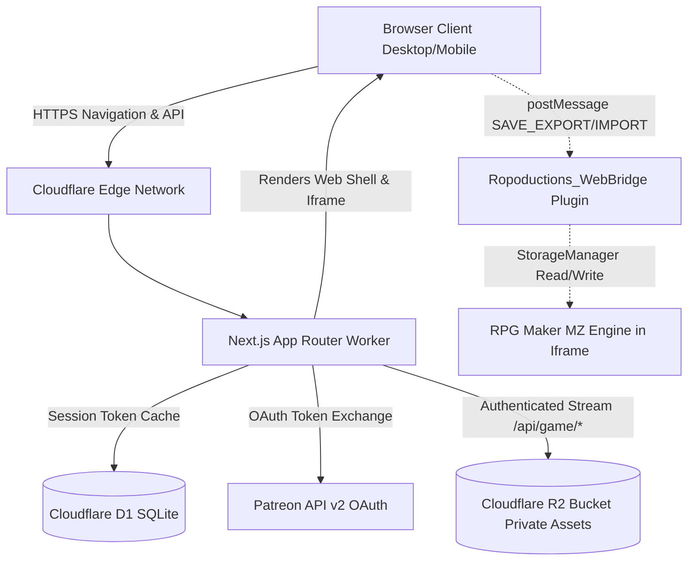
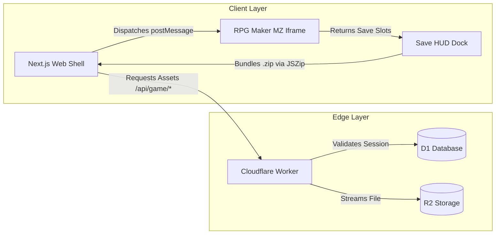

# Architecture Spine — Ropoductions Web Portal

## Design Paradigm

The system follows an **Edge-BFF (Backend-For-Frontend) with Sandboxed Engine Shell** architecture. 

* **Outer Web Shell (Next.js App Router on Cloudflare Workers):** Owns marketing presentation, 21+ age verification, Patreon OAuth 2.0 authentication, session persistence, and the floating Save HUD dock.
* **Inner Engine Shell (Sandboxed Same-Origin Iframe):** Owns execution of the compiled RPG Maker MZ HTML5/WebGL runtime, audio playback, and local `rmmz_save` storage.
* **Edge Proxy Layer (Cloudflare Worker & R2):** Owns authenticated streaming of encrypted static game assets from private object storage, verifying patron sessions at the network edge before releasing bytes.
* **Bridge Communication:** Decoupled bidirectional postMessage bus connecting the outer Web Shell to the inner game engine for save serialization and injection.



---

## Invariants & Rules

### AD-1 — Target Framework and Runtime Binding [ADOPTED]

- **Binds:** CAP-1, CAP-2, CAP-3, CAP-4, CAP-5, CAP-6, CAP-7, CAP-8
- **Prevents:** Node.js native dependency drift, vendor lock-in incompatibilities, and broken edge runtime compilations.
- **Rule:** The entire web application must be built using Next.js 15+ (App Router) compiled with `@opennextjs/cloudflare` targeting the Cloudflare Workers serverless runtime. All server route handlers must strictly use standard Web Fetch API `Request` and `Response` objects without referencing unsupported Node.js native modules (`fs`, `net`, `child_process`).

### AD-2 — Same-Origin Iframe Sandboxing for Engine Runtime [ADOPTED]

- **Binds:** CAP-5, CAP-6, FR-10, FR-13
- **Prevents:** Global `window` pollution between RPG Maker MZ engine variables (`$dataActors`, `$gamePlayer`, PixiJS) and React DOM lifecycle; prevents browser storage namespace partitioning.
- **Rule:** The RPG Maker MZ game must be hosted within a same-origin `<iframe>` element on the `/play` route. The iframe's `src` must point to `/engine/index.html` under the identical web origin (`protocol://domain:port`). Dedicated subdomains or external hosting domains are strictly prohibited to ensure uninterrupted access to the shared `IndexedDB` (`rmmz_save`) namespace across deployments.

### AD-3 — Cryptographic Session Cookie and D1 Token Isolation [ADOPTED]

- **Binds:** CAP-3, CAP-4, FR-6, FR-7, NFR-2
- **Prevents:** Exposure of Patreon OAuth access/refresh tokens to client-side JavaScript, token theft via XSS, and cookie tampering.
- **Rule:** Client browsers must only receive an opaque, signed, HTTP-only, `SameSite=Lax`, `Secure` session cookie holding a random UUIDv4 `session_id`. Patreon access tokens, refresh tokens, active tier IDs, and token expiration timestamps must be stored strictly server-side in Cloudflare D1. Route handlers and middleware must validate the session cookie against D1 before granting access to `/play` or `/api/game/*`.
### AD-4 — Origin-Locked PostMessage Save Bridge [ADOPTED]

- **Binds:** CAP-7, FR-14, FR-15
- **Prevents:** Cross-origin script injection, unauthorized save data tampering, and malicious prototype pollution crashes.
- **Rule:** Communication between the Next.js Web Shell and the in-game `Ropoductions_WebBridge.js` plugin must strictly specify and validate `event.origin === window.location.origin`. Inbound save payloads received by the bridge must validate schema structure before invoking `StorageManager.saveObject()`.

### AD-5 — Private R2 Asset Streaming with Edge Session Authentication [ADOPTED]

- **Binds:** CAP-8, FR-17, FR-18, NFR-1
- **Prevents:** Direct hotlinking, unauthorized asset ripping, and unauthenticated public scraping of static game files.
- **Rule:** The Cloudflare R2 bucket (`GAME_ASSETS`, pre-created in Cloudflare dashboard and bound in `wrangler.toml`) must remain completely private with zero public HTTP access. All asset requests must route through `/api/game/[...path]`. The route handler must verify the presence of an active patron session in D1 before streaming the file from R2. Valid responses must include `Cache-Control: private, max-age=86400` so legitimate clients cache encrypted assets locally while blocking public CDN distribution.

### AD-6 — Client-Side .zip Save Packaging and Engine Schema Invariance [ADOPTED]

- **Binds:** CAP-6, CAP-7, FR-14, FR-15
- **Prevents:** Save slot fragmentation, manual multi-file extraction friction, and patch deployment save loss.
- **Rule:** The Save HUD export action must package all populated save slots (slots 1 through 20, `global.rpgsave`, and `config.rpgsave`) into a single `.zip` archive using `jszip` client-side. The import action must accept both `.zip` archives and single `.rpgsave` files. Game developers must ensure RPG Maker MZ plugins provide fallback initialization for unpopulated variables when loading older save files into newer patch builds.

### AD-7 — Navigation-Based Subscription Verification [ADOPTED]

- **Binds:** CAP-4, FR-9, SM-C1
- **Prevents:** Abrupt mid-gameplay disconnections during active boss fights or dungeon exploration due to background token expiration.
- **Rule:** Patron subscription status verification must occur exclusively upon page navigation, entry to the `/play` route, and initial game asset requests. Periodic background polling that terminates active gameplay sessions is strictly prohibited.

### AD-8 — Parameterized D1 Database Access and Versioned Migrations [ADOPTED]

- **Binds:** CAP-3, FR-7, Architecture Evolution (v2)
- **Prevents:** SQL injection vulnerabilities and uncoordinated database schema drift.
- **Rule:** All database interactions with Cloudflare D1 must execute parameterized prepared statements (`db.prepare().bind()`). Direct string concatenation into SQL statements is prohibited. Database schema changes must be versioned as sequential SQL files under `migrations/` and deployed via Wrangler.
### AD-9 — Upstream Game Ingestion & R2 Asset Synchronization Pipeline [ADOPTED]

- **Binds:** CAP-5, CAP-8, CAP-11, FR-17, FR-18
- **Prevents:** Cloudflare Edge worker memory exhaustion from Git operations, accidental auto-deployments of broken development assets, and game engine JSON database corruption.
- **Rule:** Cloudflare Edge Workers and Pages functions MUST NEVER interact with Git repositories or execute asset ingestion at runtime. Upstream game assets from `salamin888/Final_Orginity` are ingested exclusively via a manual `workflow_dispatch` GitHub Action in `ropoductions-web` (`.github/workflows/sync-game-release.yml`). The workflow reads the release version from `tools/release.json` on `main` (or accepts a manual branch override), clones the target release branch, injects `Ropoductions_WebBridge.js` into `js/plugins/` and registers it in `js/plugins.js`, synchronizes media assets (`audio/`, `img/`, `effects/`, `movies/`, `data/`) directly to private R2 via AWS CLI S3 sync, and commits the lightweight HTML5 shell (`index.html`, `js/`, `css/`, `fonts/`) to `public/engine/`.




---

## Consistency Conventions

| Concern | Convention |
|---|---|
| File naming | `kebab-case` for components, routes, and utility modules (`age-gate-dialog.tsx`, `save-hud.tsx`). |
| API Route naming | RESTful lowercase plural paths (`/api/auth/patreon`, `/api/auth/callback`, `/api/game/[...asset]`). |
| D1 Table naming | `snake_case` plural names (`sessions`, `patrons`, `merchandise_items`). |
| D1 Column naming | `snake_case` with explicit unit suffixes (`pledge_cents`, `created_at_sec`, `expires_at_sec`). |
| PostMessage contracts | Typed actions with prefix `ROPODUCTIONS_` (`ROPODUCTIONS_EXPORT_SAVE`, `ROPODUCTIONS_IMPORT_SAVE`). |
| Error response format | JSON envelope `{ error: { code: string, message: string } }` with standard HTTP status codes. |
| Configuration | Environment variables in `.env` and `wrangler.toml` in `UPPER_SNAKE_CASE` (`PATREON_CLIENT_ID`). |
| Localization | Lightweight dictionary JSON files under `src/locales/[locale].json` with automatic fallback to `en`. |

---

## Stack

| Name | Version | Note |
|---|---|---|
| Node.js | >=20.18.0 / 24.x | Supported edge build runtime |
| Next.js | 16.3.5 | App Router + Turbopack |
| React | 19.2.8 | React 19 production build |
| @opennextjs/cloudflare | 1.20.6 | Cloudflare Workers adapter |
| Wrangler | 4.131.2 | Cloudflare Workers CLI |
| Tailwind CSS | 4.0.0 | PostCSS integration with @theme tokens |
| @radix-ui/react-dialog | 1.1.23 | Age gate & modal primitives |
| Lucide React | 1.46.0 | System icons |
| JSZip | 3.10.1 | Save .zip bundle compression |
| TypeScript | 5.8.0 | Strict mode compilation |
| next-intl | 4.14.5 | Edge localization |
---

## Design System & Theme Foundations

The portal theme standardizes on:
- **Surfaces:** `#090A0F` (Cosmic Black base), `#121522` (deep obsidian card surface), `#1A1D2B` (muted surface).
- **Accents:** `#22C55E` (Studio Emerald primary glow), `#E11D48` (crimson alert/destructive accent), `#FBBF24` (Patron Gold tier badges).
- **Typography:** Display headlines use `Chakra Petch` (Google Fonts; exported with a `cinzel` backward-compatibility alias in `src/lib/fonts.ts`), paired with `Geist Sans` for body copy and `Geist Mono` for system metadata and timestamps.

## Structural Seed

```text
ropoductions-web/
  .open-next/                         # OpenNext compilation cache
  migrations/
    0001_initial_sessions.sql         # D1 initial schema for sessions and token storage
    0002_patron_overrides.sql         # D1 schema for admin and comp role overrides
  public/
    engine/                           # Compiled RPG Maker MZ web export
      index.html                      # Engine bootstrap (sandboxed iframe entrypoint)
      js/
        plugins/
          Ropoductions_WebBridge.js   # postMessage bridge plugin for save I/O
      img/                            # Encrypted placeholder sprites
      audio/                          # Encrypted placeholder audio
      data/                           # Encrypted game JSON data
    favicon.ico
  src/
    app/
      (portal)/                       # Public studio showcase group
        layout.tsx                    # Studio layout with age gate provider
        page.tsx                      # Atmospheric landing page
      (game)/                         # Secured game player group
        play/
          layout.tsx                  # Fullscreen locked layout
          page.tsx                    # Web Player container + Save HUD dock
      (admin)/                        # Isolated studio administration group
        admin/
          overrides/
            page.tsx                  # Override directory and pass creation form
        layout.tsx                    # Minimal admin shell with anti-enumeration 404 guard
      api/
        auth/
          patreon/
            route.ts                  # OAuth 2.0 PKCE initiator
          callback/
            route.ts                  # Patreon OAuth callback and D1 session issuer
          logout/
            route.ts                  # Clears session cookie and purges D1 record
        game/
          [...asset]/
            route.ts                  # Authenticated R2 streaming proxy
    components/
      age-gate-dialog.tsx             # 21+ blocking confirmation modal
      save-hud-dock.tsx               # Floating frosted-glass save control dock
      save-import-dialog.tsx          # .zip / .rpgsave file picker and validator
      patreon-paywall-card.tsx        # Supporter tier breakdown and login trigger
    lib/
      cloudflare.ts                   # D1 and R2 binding helpers
      crypto.ts                       # Token encryption and hashing utils
      patreon.ts                      # Patreon API v2 client
      save-manager.ts                 # Client-side JSZip serialization logic
  wrangler.toml                       # Cloudflare Worker, D1, and R2 resource bindings
  package.json
  tsconfig.json
```

### Initial D1 Database Schema (`migrations/0001_initial_sessions.sql`)

```sql
CREATE TABLE IF NOT EXISTS sessions (
  id TEXT PRIMARY KEY,
  patron_id TEXT NOT NULL,
  email TEXT,
  role TEXT DEFAULT 'patron' NOT NULL CHECK(role IN ('admin', 'comp', 'patron')),
  tier_id TEXT NOT NULL,
  tier_name TEXT NOT NULL,
  pledge_cents INTEGER NOT NULL,
  encrypted_access_token TEXT NOT NULL,
  encrypted_refresh_token TEXT NOT NULL,
  token_expires_at_sec INTEGER NOT NULL,
  expires_at_sec INTEGER NOT NULL,
  revoked INTEGER DEFAULT 0 NOT NULL,
  created_at_sec INTEGER NOT NULL,
  last_verified_at_sec INTEGER NOT NULL
);

CREATE INDEX IF NOT EXISTS idx_sessions_patron_id ON sessions(patron_id);
CREATE INDEX IF NOT EXISTS idx_sessions_role ON sessions(role);
CREATE INDEX IF NOT EXISTS idx_sessions_expires_at_sec ON sessions(expires_at_sec);
CREATE INDEX IF NOT EXISTS idx_sessions_revoked ON sessions(revoked);
```

### Patron Overrides D1 Database Schema (`migrations/0002_patron_overrides.sql`)

```sql
CREATE TABLE IF NOT EXISTS patron_overrides (
  patron_id TEXT PRIMARY KEY,
  role TEXT NOT NULL CHECK(role IN ('admin', 'comp')),
  notes TEXT,
  granted_by TEXT NOT NULL,
  created_at_sec INTEGER NOT NULL,
  updated_at_sec INTEGER NOT NULL
);

CREATE INDEX IF NOT EXISTS idx_patron_overrides_role ON patron_overrides(role);

---

## Capability → Architecture Map

| Capability / Area | Lives in | Governed by |
|---|---|---|
| CAP-1 (21+ Age Verification Gate) | `src/components/age-gate-dialog.tsx` | AD-1, UX DESIGN.md (Age Gate) |
| CAP-2 (Studio Showcase Landing) | `src/app/(portal)/page.tsx` | AD-1, UX EXPERIENCE.md |
| CAP-3 (Patreon OAuth & Tier Check) | `src/app/api/auth/*`, `src/lib/patreon.ts` | AD-1, AD-3, AD-8 |
| CAP-4 (Graceful Session Re-check) | `src/middleware.ts`, `src/app/api/auth/callback` | AD-3, AD-7 |
| CAP-5 (In-Browser Game Runtime) | `public/engine/index.html`, `src/app/(game)/play/page.tsx` | AD-1, AD-2 |
| CAP-6 (Origin-Stable Save Persistence) | `public/engine/`, `rmmz_save` IndexedDB | AD-2, AD-6 |
| CAP-7 (Save HUD .zip Export/Import) | `src/components/save-hud-dock.tsx`, `Ropoductions_WebBridge.js` | AD-4, AD-6 |
| CAP-8 (Encrypted R2 Asset Protection) | `src/app/api/game/[...asset]/route.ts` | AD-1, AD-3, AD-5 |
| CAP-9 (Multilanguage Web Shell) | `src/components/language-switcher.tsx`, `src/lib/i18n.ts` | AD-1 |
| CAP-10 (Studio Admin & Overrides Panel) | `src/app/(admin)/admin/overrides/page.tsx` | AD-1, AD-8 |
| CAP-11 (Game Ingestion & R2 Sync Pipeline) | `.github/workflows/sync-game-release.yml` | AD-9 |

---

## Deferred

* **Cloud Save Synchronization (v3-v5):** Real-time cloud save syncing across player devices is deferred. Local browser storage + `.zip` manual backup completely satisfies v1 requirements.
* **Godot Web Runtime Streaming:** Godot games are cataloged for offline desktop download only in v2; browser WebAssembly compilation is deferred.
* **Merchandise Storefront & Payment Processing (v2):** E-commerce cart and Stripe/PayPal checkout are deferred to v2. Initial D1 schema accounts for future `merchandise_items` table.
* **Patreon Real-Time Webhooks:** Webhook consumer infrastructure is deferred; navigation-triggered token validation in Cloudflare Worker middleware is sufficient for v1.
