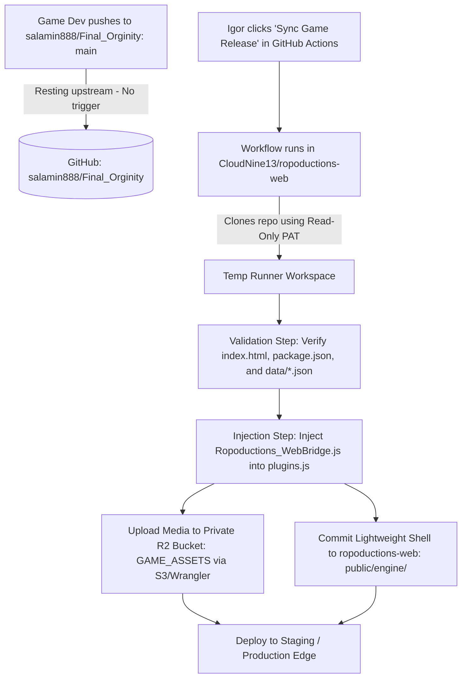

# Handoff: Game Ingestion & Automated Sync Pipeline Debate

**Date:** 2026-09-16  
**Topic:** Integrating `salamin888/Final_Orginity` into `ropoductions-web` behind the patron paywall  
**Context:** Brainstorming session with BMAD agents (Winston, Amelia, John, Sally, Mary)  
**Status:** Consensus reached on architecture; pending operational decisions for pipeline implementation.

---

## 1. Context & Discovery Summary

- **Cloudflare Pages Investigation:** The `final-orginity` project on Cloudflare Pages was linked to the private GitHub repository `salamin888/Final_Orginity` (`main` branch).
- **The 404 Explanation:** The live Pages site was returning 404 because its build command was configured as `rm -f "Final Orginity/index.html"`. The studio had intentionally broken the web entrypoint to prevent raw, unauthenticated game assets from being publicly downloaded or hotlinked without patron verification.
- **Repository Inspection (Read-Only):**
  - Engine: RPG Maker MZ HTML5 export (`Final Orginity/game.rmmzproject`).
  - Resolution: Hardcoded to 1280×720 (16:9 aspect ratio).
  - Plugin Stack: `FO_*` custom game scripts, `VisuStella MZ` core plugins, `ODW_MultiLanguageSystem`.
  - Directories: `audio/`, `img/`, `data/`, `effects/`, `movies/`, `fonts/`, `css/`, `js/`.

---

## 2. Core Architecture Consensus (Inviolable Rules)

1. **Same-Origin Sandboxed Iframe (AD-2):**
   - The game runtime shell (`index.html`, `js/`, `css/`, `fonts/`, ~10MB) must be hosted directly on the main origin at `/engine/index.html` (inside `public/engine/`).
   - *Why:* Hosting the game on a separate domain or Pages subdomain causes modern browsers (Safari ITP, Chrome Storage Partitioning) to isolate IndexedDB, wiping or partitioning patron save data (`rmmz_save`).
2. **Private R2 Asset Bucket (AD-5):**
   - Heavy static assets (`audio/`, `img/`, `effects/`, `movies/`, `data/`) must live in the private Cloudflare R2 bucket (`GAME_ASSETS`).
   - The R2 bucket has **zero public HTTP endpoints**.
3. **Edge Paywall Proxy (AD-3, Story 3.2):**
   - When the game requests assets, it calls `/api/game/[...asset]`.
   - Cloudflare Worker edge middleware inspects the `ropoductions_session` cookie against D1.
   - Active $5+ tier patrons or administrative overrides receive the stream with `Cache-Control: private, max-age=86400`. Unauthenticated visitors receive 403.
4. **Read-Only Upstream Constraint:**
   - The team has read-only collaborator access to `salamin888/Final_Orginity`. The portal repo must **never write, push, or open branches** against the upstream game repo.

---

## 3. The Agent Debate & Key Arguments

| Agent | Perspective & Concerns | Proposed Resolution |
|---|---|---|
| **Amelia (Senior Dev)** | **Vehemently opposed continuous auto-deployment on push.** Game devs commit work-in-progress maps, broken scripts, and uncompressed audio directly to `main` at odd hours. Auto-syncing on push would break production mid-game. | Automate the pipeline, but **never auto-trigger on push**. Gate it strictly on a manual dispatch trigger or formal Git release tag. |
| **Winston (Architect)** | **Opposed manual drag-and-drop / FTP.** Manual asset uploads lead to mismatched JSON schemas (e.g. updating `Map014.json` without `System.json`), causing unrecoverable engine crashes. | Build a dedicated GitHub Actions workflow (`.github/workflows/sync-game-assets.yml`) that automates validation, splitting, and deployment on demand. |
| **John (Product Manager)** | **Release control and user communication.** Patrons on Discord expect scheduled updates, patch notes, and advance warning. Mid-game asset swapping corrupts in-flight sessions. | Igor retains 100% control over release timing via a **manual "Sync Game Release" button** in GitHub Actions. |
| **Sally (UX Designer)** | **Save state integrity and viewport scaling.** RPG Maker MZ freezes or loses character sprites if variable/switch IDs in `data/System.json` shift across patches. | The pipeline must include a JSON schema integrity check, and the Save HUD must display the active `Game Build ID` so players know their version before restoring old saves. |
| **Mary (Business Analyst)** | **Security & Access Boundaries.** `salamin888` is an external account. We must not leak Cloudflare API tokens or R2 keys to external webhooks. | The workflow lives entirely inside `CloudNine13/ropoductions-web`. It pulls from `salamin888/Final_Orginity` using a read-only Fine-Grained GitHub PAT stored as a secret in *our* repository. |

---

## 4. Agreed Workflow Blueprint

---

## 5. Decisions Settled & Implementation Blueprint (2026-09-17 Session)

### 5.1 Upstream Studio Workflow Findings
1. **Trunk-Based Development on `main`:** The studio develops exclusively on `main` to prevent unresolvable RPG Maker MZ monolithic JSON database merge conflicts (`System.json`, `Items.json`, `Actors.json`) between non-technical artists and writers.
2. **Version Branches as Release Snapshots:** The studio cuts release snapshot branches named after version numbers (e.g., `0.5.8`, `0.6.0`).
3. **Upstream Version File (`tools/release.json`):** Upstream `main` contains `tools/release.json` with `{ "base": "0.6.0", "minBase": "0.6.0" }` and a publishing script `tools/publish.js`.

### 5.2 Pipeline Architecture Decisions
1. **Edge Runtime Isolation (Cloudflare Workers / Pages):**
   - **Decision:** Cloudflare Edge Workers will **never** interact with Git or perform asset synchronization. Edge isolates run under strict CPU/memory limits (128MB ceiling) and are dedicated solely to D1 session validation and R2 byte streaming via `/api/game/*`.
2. **Release Trigger Mechanism:**
   - **Decision:** Use `workflow_dispatch` (manual button in GitHub Actions) in `CloudNine13/ropoductions-web`.
   - **Auto-Default:** The workflow provides a `branch` input that defaults to `auto`. When `auto`, the runner queries `salamin888/Final_Orginity:main`'s `tools/release.json`, reads the `"base"` string (e.g. `0.6.0`), and clones that branch.
   - **Rejection of Continuous Polling / Daemon:** Background file-diff pollers and automated push webhooks were rejected because they risk deploying mid-game WIP assets, trigger premature builds before the studio finishes pushing asset fixes, and burn GitHub Actions quotas. Release deployment remains an intentional, Igor-controlled action.
3. **R2 Transfer Tooling:**
   - **Decision:** Use the **AWS S3-compatible CLI** (`aws s3 sync --endpoint-url https://<account_id>.r2.cloudflarestorage.com`) with Cloudflare R2 credentials. S3 sync calculates checksum deltas and only transfers modified audio/images, reducing ingestion run times from 15+ minutes down to under 60 seconds.
4. **Engine Shell vs. Static Asset Separation:**
   - **Static Media to Private R2 (`GAME_ASSETS`):** `audio/`, `img/`, `effects/`, `movies/`, `data/`.
   - **Lightweight Shell to Git (`public/engine/`):** `index.html`, `js/`, `css/`, `fonts/`, `icon/` (~8–10MB).
5. **In-Game Web Bridge (`Ropoductions_WebBridge.js`) Injection:**
   - **Decision:** Ingestion workflow automatically copies `Ropoductions_WebBridge.js` into `public/engine/js/plugins/` and registers `{ "name": "Ropoductions_WebBridge", "status": true, "description": "Web Shell PostMessage Save Bridge", "parameters": {} }` in `public/engine/js/plugins.js`.
   - **Protocol:** Enforces `event.origin === window.location.origin`. Handles `ROPODUCTIONS_GET_SAVES` and `ROPODUCTIONS_SET_SAVES` via RPG Maker MZ's `StorageManager`.
   - **Instant Index Refresh:** Upon importing saves, the bridge invokes `DataManager.loadGlobalInfo()` so the in-game "Continue" / load screen updates immediately without requiring an iframe or page reload.
6. **Video Cutscene Handling:**
   - **Decision:** Streamed via `/api/game/movies/*` from R2 with HTTP 206 Partial Content byte-range support enabled in the Next.js/Worker route handler.

---

## 6. Actionable Implementation Checklist

- [ ] Create `.github/workflows/sync-game-release.yml` with `workflow_dispatch` (input: `branch`, default `auto`).
- [ ] Add GitHub Secrets: `UPSTREAM_READ_TOKEN` (fine-grained PAT for `salamin888/Final_Orginity`), `R2_ACCESS_KEY_ID`, `R2_SECRET_ACCESS_KEY`, `CLOUDFLARE_ACCOUNT_ID`.
- [ ] Implement `Ropoductions_WebBridge.js` plugin under `src/engine-plugins/Ropoductions_WebBridge.js` with postMessage listener, origin checking, and `StorageManager` / `DataManager` hooks.
- [ ] Implement Save HUD import modal with JSZip client-side unzipping, header validation, and error handling.
